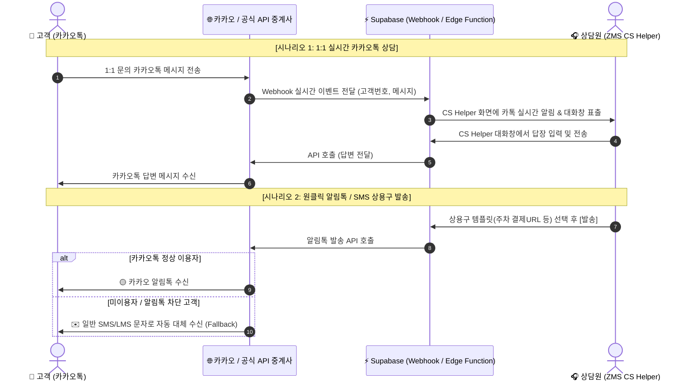

# 📄 [기획안] ZMS CS Helper - 카카오톡 상담톡(1:1 실시간 응대) & 알림톡 API 통합 연동 안건

> **문서 번호**: PROPOSAL-20260813-KAKAO  
> **기획 목적**: 사내 CS 관리 플랫폼(ZMS CS Helper) 내 카카오톡 1:1 상담 및 알림톡 API 통합 구축  
> **보고 대상**: 상급 부서 및 카카오 채널/IT 인프라 관리자  

---

## 1. 📌 추진 배경 및 필요성

### 1.1 현상 분석 (As-Is)
* **삼중 응대 환경 파편화**: 상담원이 CS 업무 수행 시 ① CTI 유선전화 시스템, ② ZMS CS Helper 웹, ③ 카카오톡 채널 관리자 웹사이트(외부) 3개 화면을 복수로 켜두고 응대 중.
* **고객 상담 이력 분절**: 전화로 문의한 고객이 카카오톡으로 재문의하거나, 카카오톡 문의 후 전화를 주었을 때 **이전 대화 이력이 연동되지 않아 중복 설명 요구 발생**.
* **알림문자 수동발송 공수**: 주차 결제 URL 및 안내 문구 발송 시, 고객 번호를 복사하여 카카오톡 관리자 페이지에서 일일이 수동 검색/발송하여 처리 시간 지연.

### 1.2 개선 방향 (To-Be)
* **단일 플랫폼(Single Pane of Glass) 구축**: ZMS CS Helper 화면 하나에서 **유선 전화, CTI 녹취 AI 요약, 카카오톡 1:1 실시간 대화**를 통합 처리.
* **고객 DB 기반 100% 이력 자산화**: 유선 전화 이력 + CTI AI 요약본 + 카카오톡 대화록이 고객 단원(`customers`)으로 100% 매칭되어 영구 보존.
* **자동 대체 발송(Fallback) 탑재**: 카카오톡 미사용자 또는 차단 고객에게도 일반 SMS/LMS 문자로 자동 전환 발송되어 100% 도달 보장.

---

## 2. 🏗️ 연동 메커니즘 및 기존 채널 보존 방안

### 2.1 기존 회사 카카오톡 채널 안전성 검증
> [!IMPORTANT]
> **회사 기존 카카오톡 채널 100% 영구 보존**:
> 본 연동 작업은 기존 회사 카카오톡 채널(프로필, 친구 수, 검색용 ID, 기존 히스토리)을 그대로 유지한 상태에서 진행됩니다. 카카오톡 채널 관리자 센터의 설정 모드를 **'상담톡 연동(API) 모드'**로 전환하는 방식이므로 **채널 재개설이나 기존 고객 이탈이 일절 없습니다.**

### 2.2 도입 방식 비교 (카카오 본사 vs 공식 인증 중계사 API)
카카오 본사 정책상 대기업 특수 직계약을 제외하고는 **카카오 공식 인증 중계사(Solapi, Aligo, HappyTalk 등)**의 REST API를 통해서만 안전하게 연동이 허용됩니다.

| 구분 | 기존 카카오톡 채널 관리자 웹 | **ZMS CS Helper 통합 API 연동** |
|---|---|---|
| **응대 환경** | 외부 카카오 전용 사이트 접속 | **ZMS CS Helper 내부 실시간 패널 내장** |
| **상담 이력 관리** | 카카오 서버에만 파편화 수록 | **Supabase DB에 자동 저장 (유선 이력과 통합)** |
| **발송 실패 조치** | 수동 확인 및 재발송 필요 | **카톡 차단 시 SMS/LMS 문자 자동 대체 발송 (Fallback)** |
| **기존 채널 영향** | 채널 유지 | **채널 ID / 친구 수 / 프로필 100% 그대로 사용** |

---

## 3. 🎯 핵심 기능 및 프로세스 흐름도 (Sequence Diagram)



### 3.1 주요 기능 명세
1. **실시간 1:1 카톡 상담 패널 (`KakaoChatPanel.tsx`)**
   * CS Helper 우측 작업창에 카카오톡 1:1 대화 패널 탑재.
   * 실시간 메시지 인입 시 탑바 🔔 알림 및 알림음 지원.
   * 이미지, 첨부파일, 텍스트 실시간 대화 지원.
2. **원클릭 알림톡/SMS 상용구 발송**
   * 주차 매칭 결제 링크, 안내 상용구를 원클릭으로 카카오톡/문자 즉시 발송.
3. **전화번호 기반 동적 고객 이력 자동 매칭**
   * 카카오톡 인입 시 고객 전화번호로 기존 주차 예약건, 유선 통화 CTI 녹취 요약본을 화면에 자동 바인딩.

---

## 4. 🛡️ 보안 및 시스템 아키텍처

```
[ ZMS CS Helper Client (React) ]
         │ (HTTPS / Secure WebSocket)
         ▼
[ Supabase Edge Functions / Webhook ] ──▶ API Key 전용 세이프가드 (.env/Secrets)
         │ (TLS 1.3 암호화 통신)
         ▼
[ 카카오 공식 인증 중계사 API Gateway ]
         │ (전용선 / Direct SSL)
         ▼
[ Kakao & 이동통신사 망 ]
```

* **보안 대책**:
  * API Key 및 비밀번호는 클라이언트 코드에 직접 노출하지 않고, Supabase Vault 및 Edge Functions 환경변수로 엄격히 격리.
  * 고객 전화번호 및 대화록 데이터는 Supabase RLS(Row Level Security) 정책을 적용하여 사내 승인된 상담원 세션만 접근 가능하도록 조치.

---

## 5. 📅 단계별 추진 일정 (4 Weeks Roadmap)

| 단계 | 추진 내용 | 세부 작업 | 비고 |
|---|---|---|---|
| **1단계: 행정 & 준비 (Week 1)** | • 카카오톡 채널 관리자 센터 '상담톡' 연동 승인 신청<br>• 연동 API 대행사(예: 솔라피/알리고) 계정 생성 및 API Key 발급 | 사업자등록증 및 채널 관리자 권한 필요 |
| **2단계: 화면/UI 개발 (Week 2)** | • ZMS CS Helper 내 카카오톡 1:1 대화 패널 UI 개발<br>• 상용구 템플릿 모달 API 바인딩 | 소스코드 변경 및 개발 환경(Sandbox) 테스트 |
| **3단계: 백엔드/웹훅 (Week 3)** | • Supabase Webhook 수신부 구축<br>• 실시간 톡 대화록 DB 자동 적재 연동 | Realtime 수신 파이프라인 구축 |
| **4단계: QA & 본배포 (Week 4)** | • 모바일 실제 기기 기반 수발송 종합 QA 테스트<br>• 운영 배포 및 상담원 사용자 교육 | 실서버 오픈 |

---

## 6. 📊 기대 효과 (Expected ROI)

1. **상담 응대 속도 35% 이상 향상**: 유선 전화와 카카오톡 문의를 단일 화면에서 처리하여 화면 전환 공수 제거.
2. **상담 데이터 100% 자산화**: 전화 녹취 요약본 + 카톡 대화록이 하나의 고객 프로필 아래 일렬로 통합 적재되어 악성 클레임 방지.
3. **고객 만족도 증대**: 미수신 유선 전화 발생 시 카카오톡으로 안내 문구가 자동 연동되어 고객 대기 시간 대폭 감소.

---
* **문서 작성일**: 2026년 08월 13일  
* **작성자**: ZMS CS Helper 개발/기획팀  
